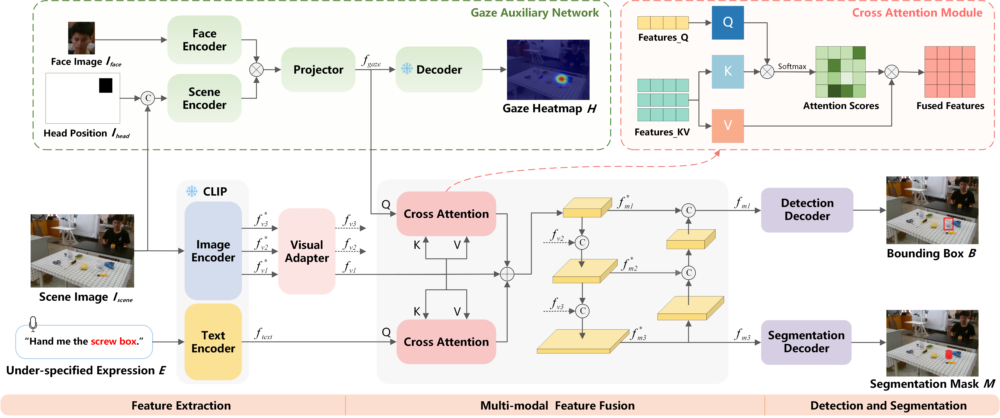

# GVGNet_KD
The official PyTorch implementation of the paper "Gaze-assisted Visual Grounding via Knowledge Distillation for Referred Object Grasping with Under-specified Object Referring".

Zhuoyang Zhang, Kun Qian, Bo Zhou, Fang Fang, and Xudong Ma.

<p align="center">
  
</p>

**Contributions:**
* A novel visual grounding network is proposed to facilitate REC and RES tasks when the object referring expressions are under-specified. The proposed approach incorporates a gaze auxiliary network through knowledge distillation to eliminate referring ambiguity.
* A cross-attention-based multi-modal fusion module with a balanced structure is proposed, which leverages language and gaze modalities to assign attention weights of visual features and achieves consistent feature extraction for referred object disambiguation.
* A new tabletop objects dataset with both human gaze and under-specified referring expressions is established, namely TOD-underRef. The experimental results on the dataset demonstrate that our method outperforms the state-of-the-art methods in REC and RES accuracy. Real-world robotic grasping experiment further validates the effectiveness of our method in referred object grasping tasks with referring ambiguity.

## Environment
```
pytorch==1.11.0
torchvision==0.12.0
opencv-python==4.5.5.64
pillow
numpy
tensorboardX
tqdm
```

## Training
```
python train_engine.py
```

## Acknowledge
Thanks a lot for the code from the following repos

* [SimREC](https://github.com/luogen1996/SimREC/tree/main)

* [SimKD](https://github.com/DefangChen/SimKD)

* [attention-target-detection](https://github.com/ejcgt/attention-target-detection)

* [CLIP](https://github.com/openai/CLIP)
